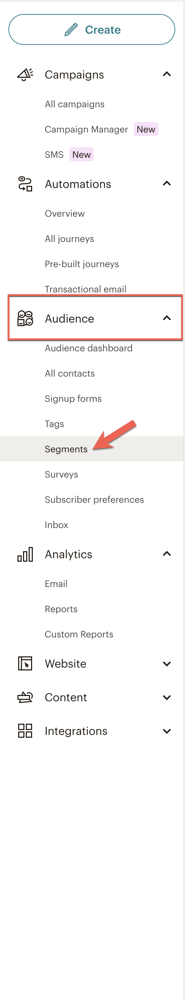
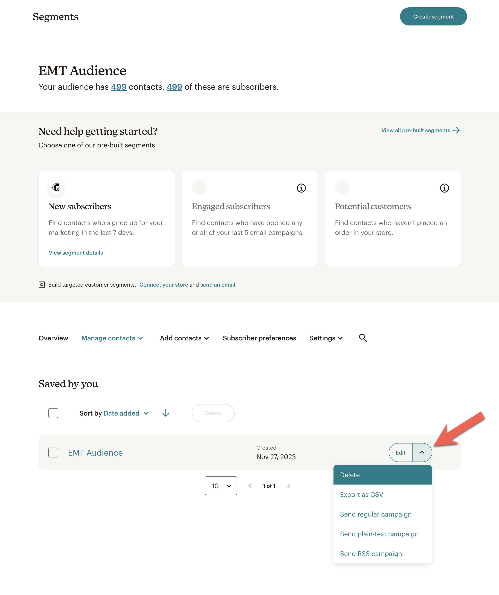
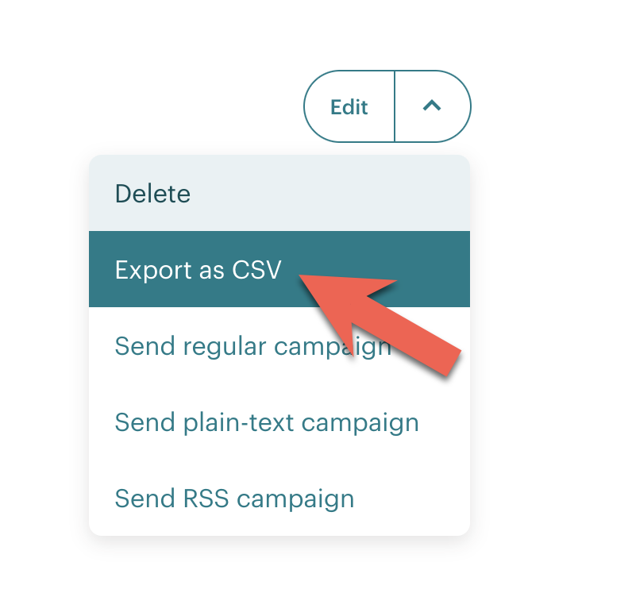
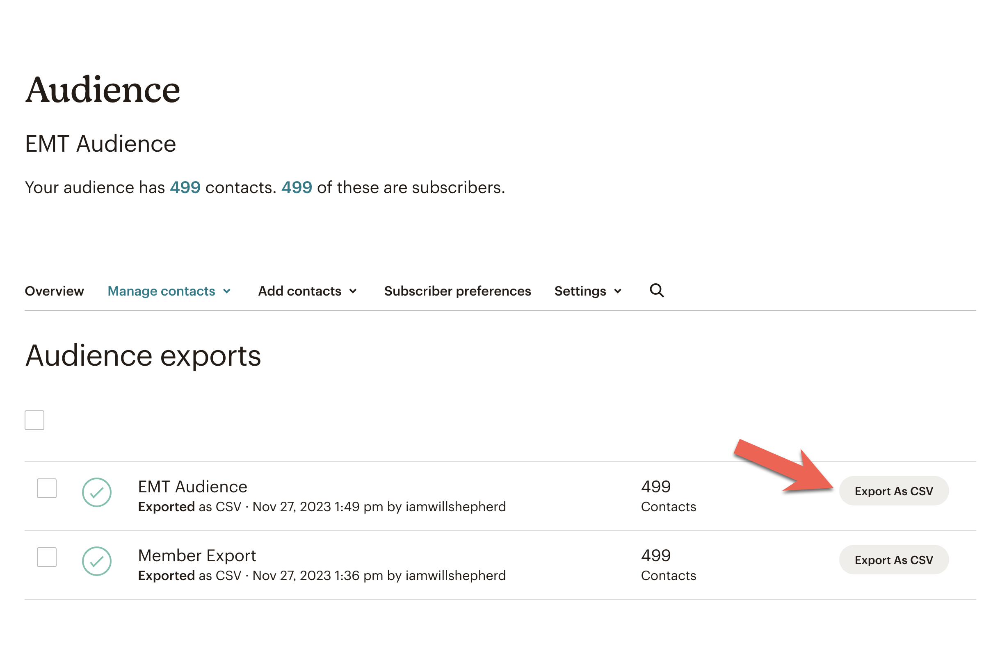

# Mailchimp

#### Assumptions

- Access to the MailChimp Dashboard.
- Knowledge of the Audience to export.
- The audience was segmented using Tags.
- The contact list contains fewer than 10,000 contacts.

### Steps

1. **Audience Page Access**: Go to `Audience > Segments`.
2. **Segment Selection**: Find the Segment you wish to export.
3. **Export Option**: Click the context menu next to the **Edit** button.
4. **Initiate Export**: Select **Export as CSV**. This redirects you to the Audience Export Page.
5. **Download File**: Click **Export As CSV** to receive a Zip archive.
6. **Extract Data**: Unzip the archive to access the CSV files.

## Notes

###### Step 1

###### Step 3

###### Step 4

###### Step 5

