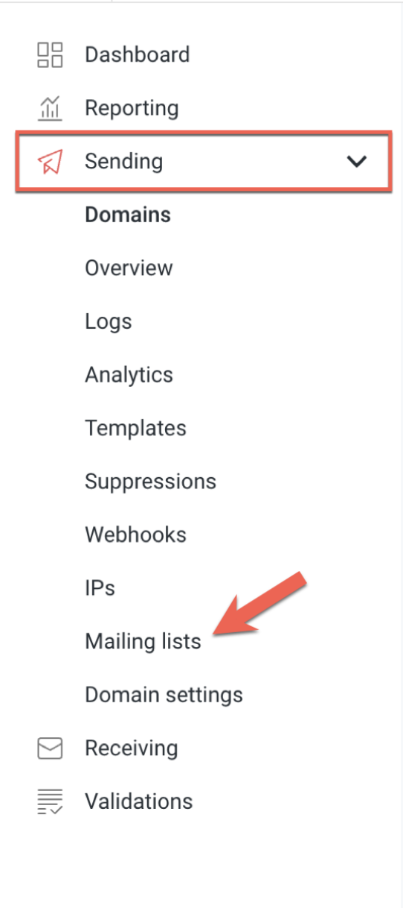
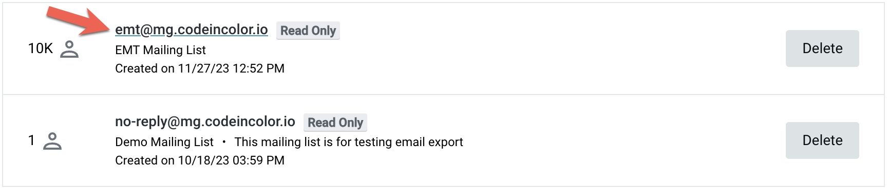
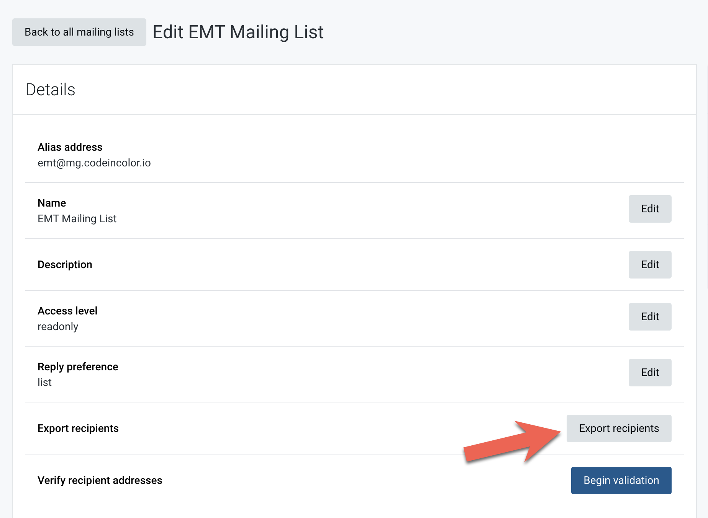
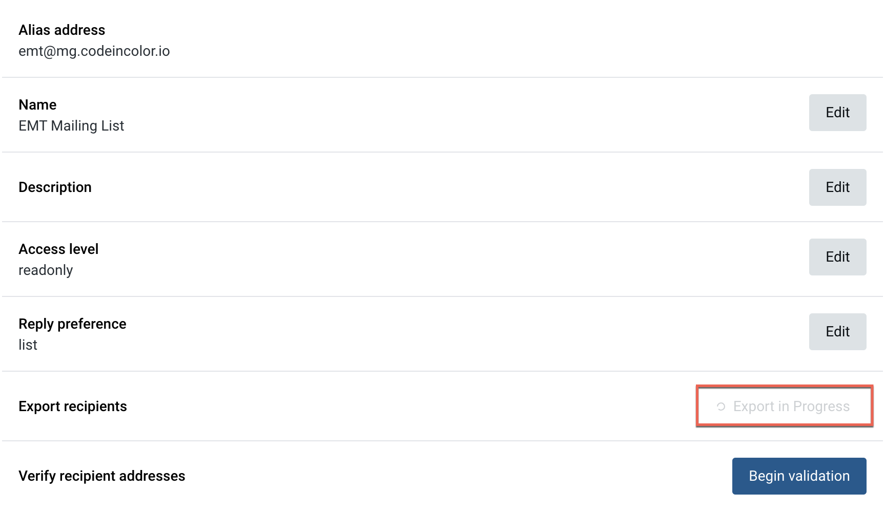
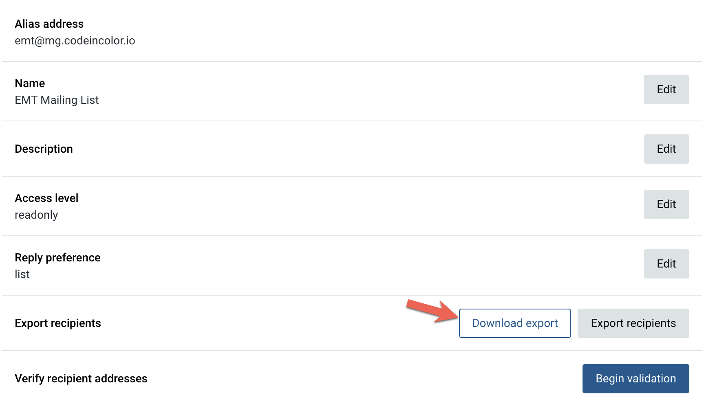

## Assumptions

- The user is starting from the Mailgun Dashboard
- The user knows which Mailing List they'd like to export
- The contact list has less than 10k contacts

## Instructions

1. Navigate to the Mailing List page, Sending > Mailing list
2. Locate the list that you'd like to export
3. Click on the 'from' email address of the list to export; you'll be taken to the Edit Mailing List Page
4. Under **Details**, click the **Export recipients** button to request a new export (The status may state _Export in Progress_ for several moments)
5. Once the export completes, click the **Download export** button
6. The file will be saved to your downloads directory

## Notes

###### Step 1

###### Step 3

###### Step 4

*Export in progress*

###### Step 5

