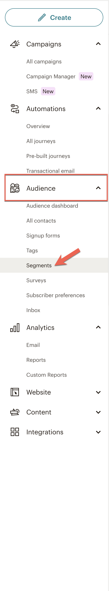

## Assumptions

- The user is starting from the MailChimp Dashboard
- The user knows which Audience they'd like to export
- The user has segmented their audience using Tags
- The contact list has less than 10k contacts

## Instructions

1. Navigate to the Audience page, Audience > Segments
2. Locate the Segment you'd like to export
3. Click the context menu button next to the **Edit** button
4. Choose the **Export as CSV** option. You will be taken to the Audience Export Page
5. Click the **Export As CSV** button to download a Zip archive of the completed export
6. Extract the CSV files from the archive

## Notes

###### Step 1

###### Step 3

###### Step 4

###### Step 5

