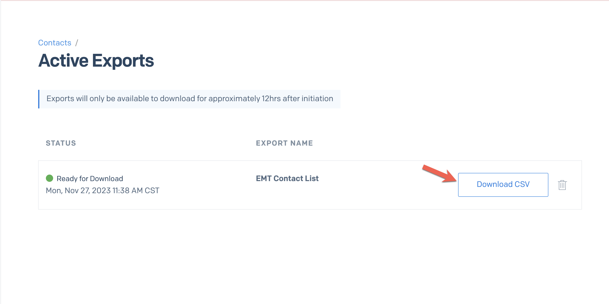

## Assumptions

- The user is starting from the SendGrid Dashboard
- The user knows the Contact List they'd like to export
- The contact list has less than 2k contacts

## Instructions

1. Navigate to the Contact Lists page, Marketing > Contacts
2. Locate the list that you'd like to export
3. Click to open the context menu under the **Action** list header
4. Choose **Export** (you'll be taken to the Contact > Active Exports page)
5. When the **Status** states 'Ready for Download', click the **Download CSV** button.
6. The file will be saved to your downloads directory

## Notes

###### Step 1

###### Step 3

###### Step 5

